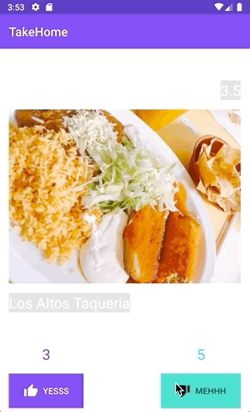

# Affirm Take Home Assignment

This is an assignment to test you on reading the existing codebase and adding some logic to it.

## The app
The complete app is an app that loads the restaurants from two APIs (Yelp and Places). The user can tap "YESSS" or "MEHHH" to indicate if they like or dislike the restaurants. The counters on top of the buttons will be updated accordingly.

## The challenge
The challenge should take 90 ~ 120 minutes to complete.

We provided some skeleton code to you and you can work on top of it or modify the existing code as you wish.

### Requirements
#### Complete this app
Write the logic to query some restaurants from two APIs. The data model is already implemented.

[Yelp API](https://www.yelp.com/developers/documentation/v3/get_started)

[Places API](https://developers.google.com/maps/documentation/places/web-service/search#PlaceSearchRequests)

We load a maximum of 20 restaurants at a time. When the user approaches to the last couple restaurants, we want the app to load more restaurants.
The way we load from the two resources should be alternatively. E.g. load first batch from Yelp, second batch from Places, then Yelp, then Places, so on and so forth.

The two APIs fetch results in a slightly different way. Yelp fetches additional results using an "offset" integer value. The Places API will provide additional results (if available) via a "nextPageToken" that will be included with the search results.

Properly dealing with two different APIs is part of the challenge.

#### Complete a writeup
Write a simple text file about how long you spent on completing this exercise and what architecture/libraries you chose to complete the app. Also include where you think the app can improve.

### Criteria
We will evaluate programs on correctness and code quality.

For correctness, we expect that the restaurants will be loaded and displayed correctly. After first batch of the restaurants, the next batch of the restaurants will come from a different source. Once the user clicks the "Yes" or "No" button, the counter also gets updated.

For quality, we expect code to be easy to read and maintain, have separation of concerns. We will be grading based on the architectural decisions that you made. (You can write about it briefly in the writeup)

You will NOT be graded on tests.

### FAQs
Q: The skeleton code is in Kotlin, can I use Java?
A: Yes! If you aren't very familiar with Kotlin, it's totally fine! Kotlin code can be easily called by Java and vice versa. You can create your part of the code in Java.

Q: Code provided imports for "FusedLocationProviderClient", can I use something else?
A: Sure!

Q: I see the skeleton code has room for improvement, can I improve it?
A: Yes we'd like to hear your thought!

Q: My emulator's location services don't work!
A: Use a real device. If you don't have one, make sure you are using an emulator with the play store available. Open the Google Maps app on the emulator to test if location services are working.
